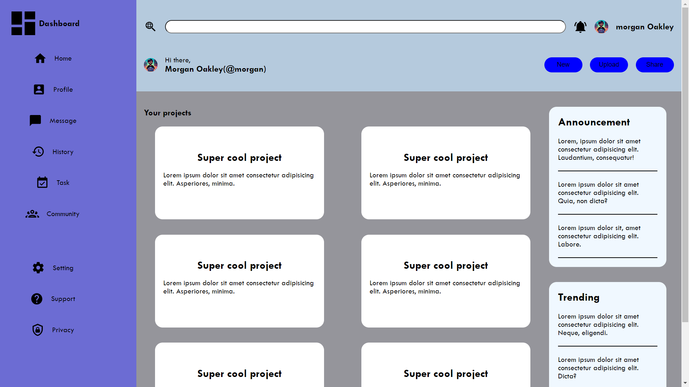

# Admin Dashboard Project Details

[View Live Project](https://abhi6777.github.io/Admin_Dashboard/)

This is not dynamic website, It is a Static website.

This project is an Admin Dashboard designed for managing various tasks and accessing different sections of an application. It includes features such as a navigation menu, user profile section, project listings, announcements, and trending topics.

## Features:

- **Navigation Menu:** Allows users to navigate between different sections of the dashboard, such as Home, Profile, Messages, History, Tasks, and Community.
  
- **User Profile Section:** Displays user information and provides options for new actions, uploads, and sharing.
  
- **Project Listings:** Shows a list of projects with details like project name and description.
  
- **Announcements:** Provides announcements for important updates or events.
  
- **Trending Topics:** Displays trending topics or discussions.